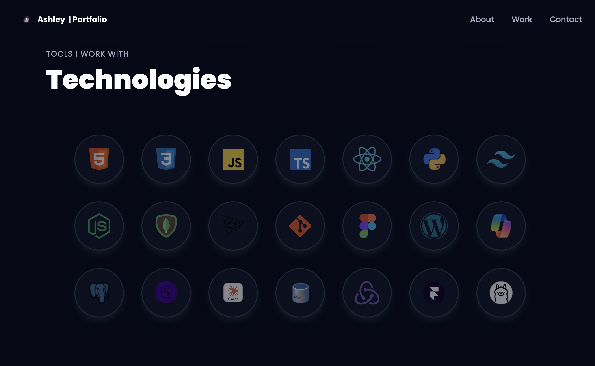
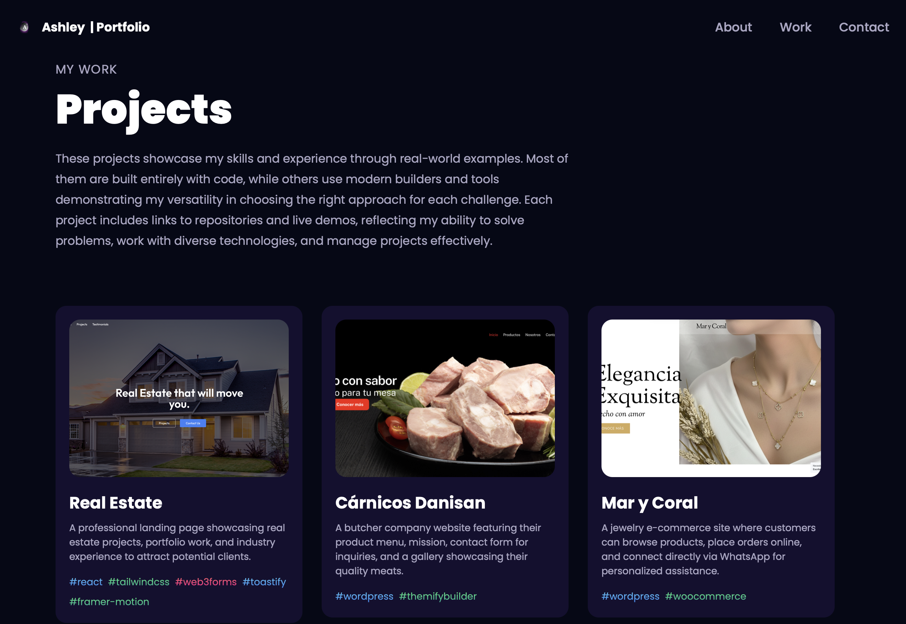
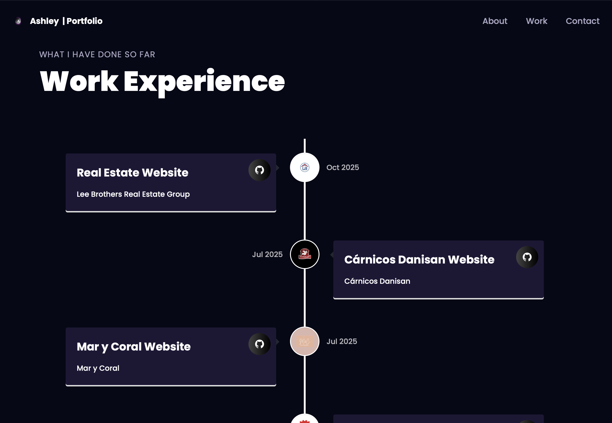
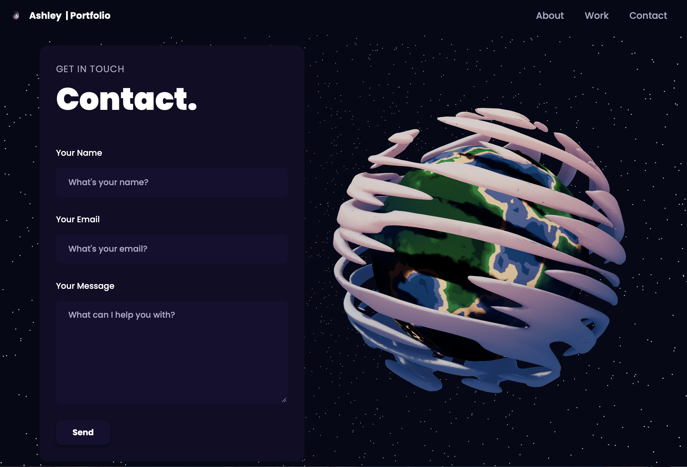

# 🚀 Personal Portfolio

<div align="center">



**A modern, interactive portfolio showcasing my projects and skills**

[](https://reactjs.org/)
[](https://vitejs.dev/)
[](https://threejs.org/)
[](https://tailwindcss.com/)
[](https://www.framer.com/motion/)

[🌐 Live Demo](https://www.ashleymsanchez.com) • [📂 View Code](https://github.com/ashleymichelle5/Portfolio) • [📧 Contact Me](mailto:ashleymsanchez05@gmail.com)

</div>

---

## 📖 About This Project

This is my personal portfolio website, built to showcase my skills, projects, and professional journey as a developer. Featuring cutting-edge web technologies and stunning 3D graphics, this portfolio demonstrates my expertise in modern web development and interactive user experiences.

### 🎯 Purpose

- Present my professional experience and skills
- Showcase my best projects with detailed descriptions
- Demonstrate proficiency in modern web technologies
- Offer an easy way for potential employers and clients to contact me

---

## ✨ Features

- 🎨 **Modern UI/UX** - Clean, professional design with smooth animations
- 🌟 **3D Graphics** - Interactive 3D elements powered by Three.js
- 📱 **Fully Responsive** - Optimized for all devices and screen sizes
- ⚡ **Lightning Fast** - Built with Vite for optimal performance
- 🎭 **Smooth Animations** - Fluid transitions using Framer Motion
- 🧭 **Easy Navigation** - Intuitive routing with React Router
- 💼 **Project Showcase** - Detailed project cards with links and descriptions
- 📊 **Skills Display** - Visual representation of technical skills
- 💬 **Contact Form** - Functional contact section for easy communication
- 🌌 **Animated Background** - Dynamic star canvas for visual appeal

---

## 🖥️ Screenshots

<div align="center">

### Hero Section


### Projects Showcase


### Experience Timeline


### Contact Form


</div>

---

## 🛠️ Built With

### Core Technologies


### Styling & Animation


### 3D Graphics


### Routing


---

## 📦 Key Dependencies

| Package | Version | Purpose |
|---------|---------|---------|
| `react` | ^18.x | UI library for building components |
| `react-dom` | ^18.x | React rendering for web |
| `vite` | ^5.x | Next-generation frontend tooling |
| `tailwindcss` | ^3.x | Utility-first CSS framework |
| `three` | ^0.160.x | 3D graphics library |
| `@react-three/fiber` | ^8.x | React renderer for Three.js |
| `@react-three/drei` | ^9.x | Useful helpers for React Three Fiber |
| `framer-motion` | ^11.x | Production-ready animation library |
| `react-router-dom` | ^6.x | Routing library for React |
| `react-vertical-timeline-component` | ^3.x | Vertical timeline component |
| `react-tilt` | ^1.x | Parallax tilt effect for React |
| `emailjs-com` | ^3.x | Email service integration |

---


## 🏗️ Project Structure
```
portfolio/
├── public/
│   ├── desktop_pc/          # 3D model assets
│   ├── planet/
│   └── logo.svg
├── src/
│   ├── assets/              # Images, icons, and static files
│   │   ├── index.js
│   │   └── ...
│   ├── components/          # React components
│   │   ├── About.jsx
│   │   ├── Contact.jsx
│   │   ├── Experience.jsx
│   │   ├── Feedbacks.jsx
│   │   ├── Hero.jsx
│   │   ├── Navbar.jsx
│   │   ├── Tech.jsx
│   │   ├── Works.jsx
│   │   ├── canvas/
│   │   │   ├── StarsCanvas.jsx
│   │   │   ├── Ball.jsx
│   │   │   ├── Computers.jsx
│   │   │   └── Earth.jsx
│   │   └── index.js
│   ├── constants/           # Configuration and data
│   │   └── index.js
│   ├── hoc/                 # Higher-order components
│   │   ├── SectionWrapper.jsx
│   │   └── index.js
│   ├── utils/               # Utility functions
│   │   └── motion.js        # Framer Motion variants (fadeIn, etc.)
│   ├── App.jsx              # Main App component
│   ├── main.jsx             # Entry point
│   ├── index.css            # Global styles
│   └── styles.js            # Tailwind style utilities
├── .gitignore
├── index.html
├── package.json
├── postcss.config.js
├── tailwind.config.js
├── vite.config.js
└── README.md
```

---

## 🎨 Component Overview

### Core Components

| Component | Description |
|-----------|-------------|
| `<Navbar />` | Responsive navigation bar with smooth scrolling links |
| `<Hero />` | Landing section with 3D computer model and introduction |
| `<About />` | Professional summary with animated service cards |
| `<Experience />` | Interactive vertical timeline of work experience |
| `<Tech />` | Animated tech stack showcase |
| `<Works />` | Project portfolio with tilt effects and links |
| `<Feedbacks />` | Testimonials section with client reviews |
| `<Contact />` | Functional contact form with EmailJS integration |

### Canvas Components (3D)

| Component | Description |
|-----------|-------------|
| `<StarsCanvas />` | Animated starfield background |
| `<ComputersCanvas />` | 3D computer model with lighting |
| `<BallCanvas />` | Tech stack spheres |
| `<EarthCanvas />` | Rotating 3D Earth model |

### Utility Functions

- `fadeIn(direction, type, delay, duration)` - Framer Motion animation variant
- `textVariant()` - Text animation configurations
- `slideIn()` - Slide-in animations
- `staggerContainer()` - Staggered children animations
- `zoomIn()` - Zoom animation effects

---

**Ashley Sanchez**

- 🌐 Portfolio: [ashleymsanchez.com](https://www.ashleymsanchez.com)
- 💼 LinkedIn: [Ashley Sanchez](https://www.linkedin.com/in/ashley-sanchez-029331390/)
- 🐙 GitHub: [@ashleymichelle5](https://github.com/ashleymichelle5)
- 📧 Email: ashleymsanchez05@gmail.com


---
